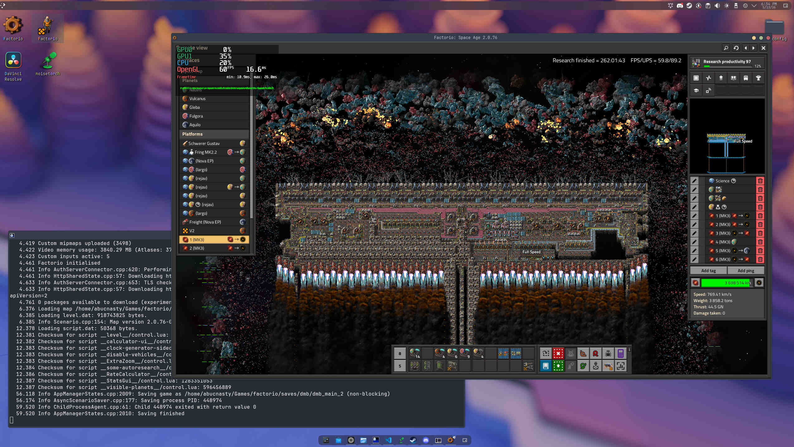
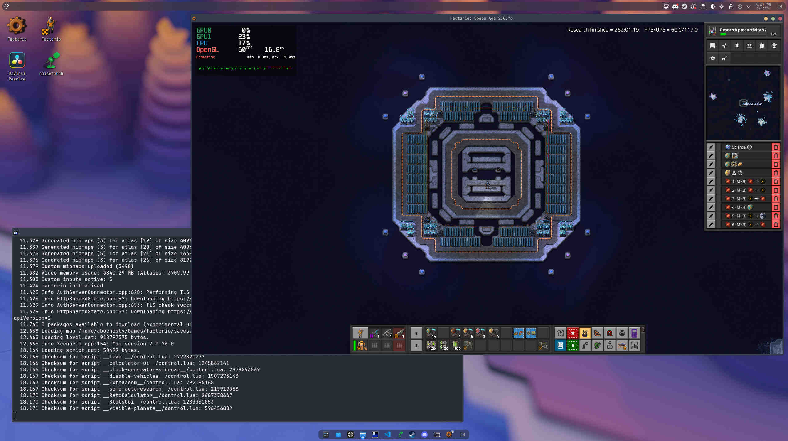
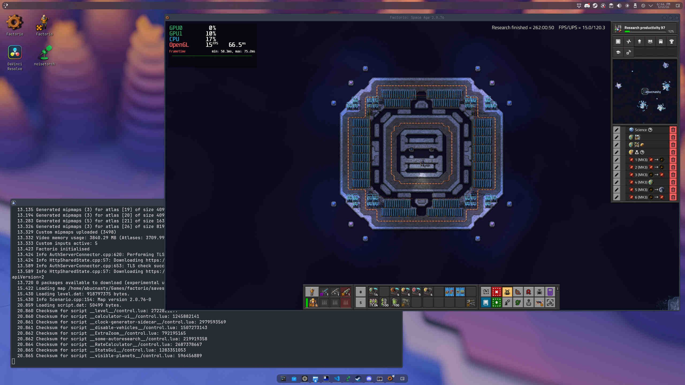
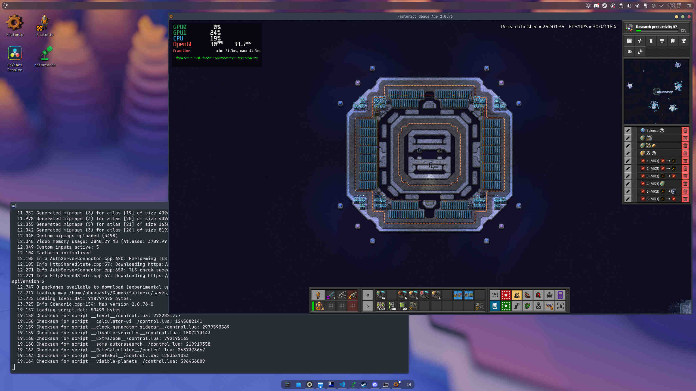
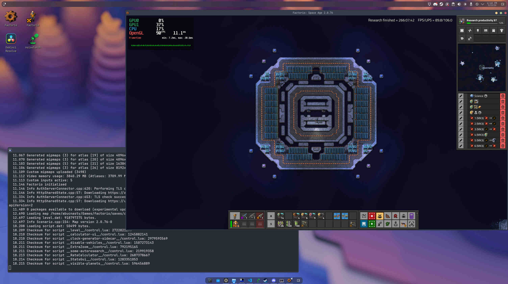
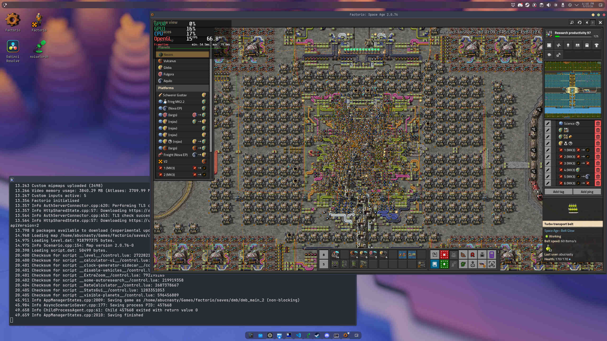
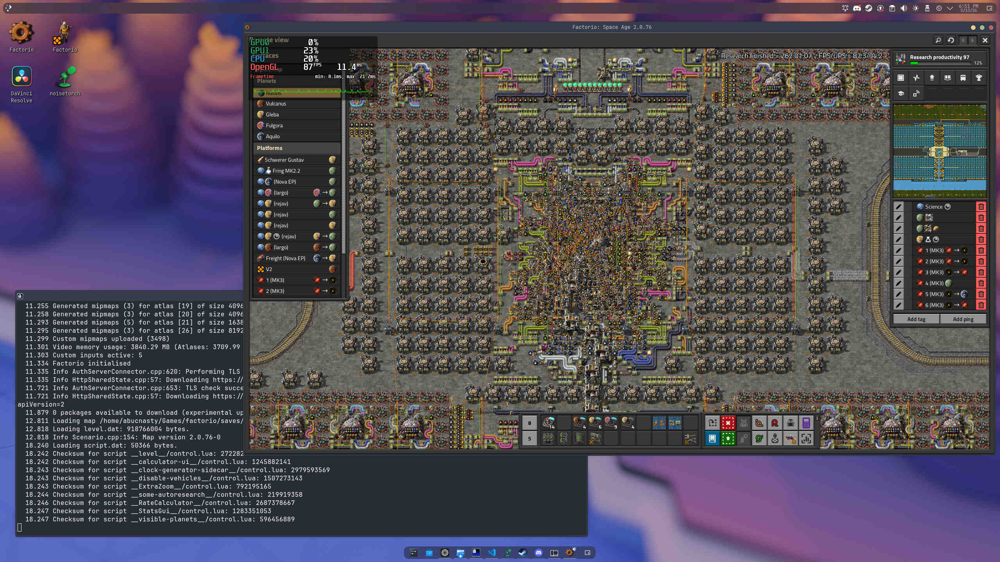
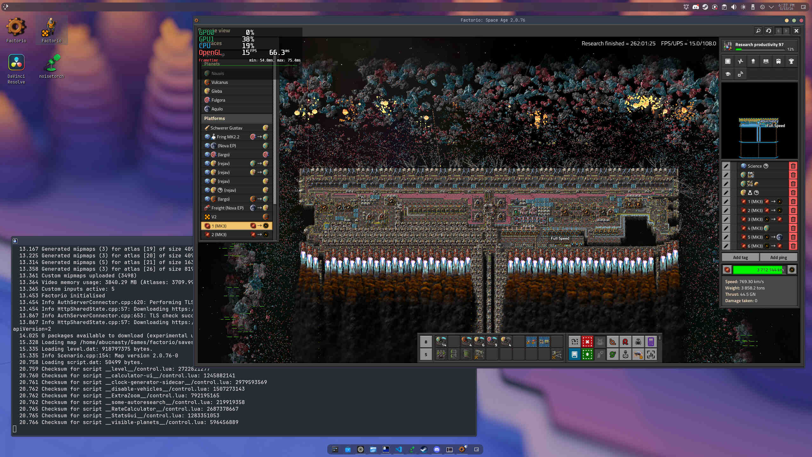
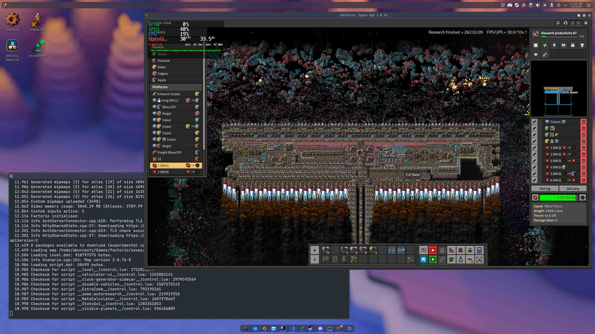
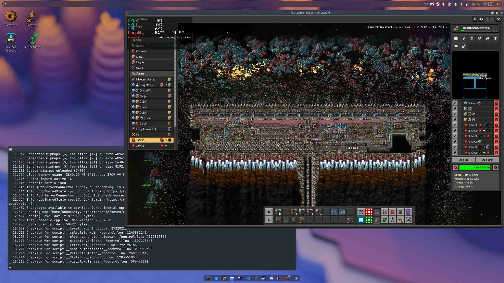

## The Question

Does limiting the FPS of the game have an impact on UPS?

## Answer

Yes, reducing FPS does boost UPS.

## Definitions

| Term | Description                            |
| ---- | -------------------------------------- |
| FPS  | Frames Per Second (render speed)       |
| UPS  | Updates Per Second (game update speed) |

## Scenario

The view finder of the player is positioned in three locations in a save file. The save file produces 115k SPM running research productivity. The game is paused using the editor and saved. The FPS of the game is limited and the same save file is started. A screenshot is taken after 30 seconds and the UPS number is recorded for each scenario and each FPS cap.

> Note: This is a crude experiment without running the benchmark command built into factorio since the benchmark command runs headless without a user interface. 
> 
> Although there is just one screenshot captured per scenario and FPS limit, the correlation still exists and is enough to verify the results of the experiment given the percent differences observed.

**Libraries and Scripts**

For each save file, two libraries are injected:
1. [mimalloc](https://github.com/microsoft/mimalloc)
2. [mangohud](https://github.com/flightlessmango/MangoHud/#normal-usage)

`mangohud` is used to display the overlay graphic on top of factorio and to limit the fps of the game. `mimalloc` is used solely due to the fact that I already use this for boosting UPS for the game and wanted to explore if limiting the FPS has any impact.

Both libraries are injected using the `LD_PRELOAD` environment variable. The following scipt was used, modifying the `fps_limit` argument respectively for each scenario.

```sh
#!/bin/bash
LD_PRELOAD="/home/abucnasty/dev/temp/mimalloc/out/release/libmimalloc.so /usr/lib64/mangohud/libMangoHud_shim.so" \
MANGOHUD_CONFIG=fps_limit=15 \
exec gamemoderun /home/abucnasty/Games/factorio/bin/x64/factorio "$@" --cache-sprite-atlas=true
```

Hardware:
```
CPU: Ryzen 9800X3D
Memory: 2x16GB CL30 DDR5 (Model Number: MH32GX5M2B600Z30K)
GPU: GeForce RTX 3080
```


## Scenario 1: Viewing a Promethium Ship



| Scene           | FPS Limit | UPS   |
| --------------- | --------- | ----- |
| Promethium Ship | 90        | 83.5  |
| Promethium Ship | 60        | 89.2  |
| Promethium Ship | 30        | 104.1 |
| Promethium Ship | 15        | 108.0 |


## Scenario 2: Character on Aquillo



| Scene          | FPS Limit | UPS   |
| -------------- | --------- | ----- |
| Aquillo Island | 90        | 106.0 |
| Aquillo Island | 60        | 117.0 |
| Aquillo Island | 30        | 116.4 |
| Aquillo Island | 15        | 120.3 |

## Scenario 3: Nauvis Hub


| Scene      | FPS Limit | UPS   |
| ---------- | --------- | ----- |
| Nauvis Hub | 90        | 94.2  |
| Nauvis Hub | 60        | 98.4  |
| Nauvis Hub | 30        | 108.6 |
| Nauvis Hub | 15        | 112.6 |


## Image Gallery


 
 
 

 
 
 
 
 
 
 
